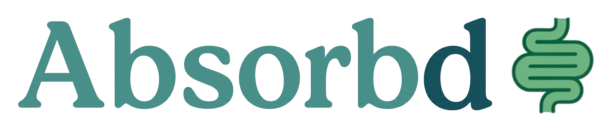
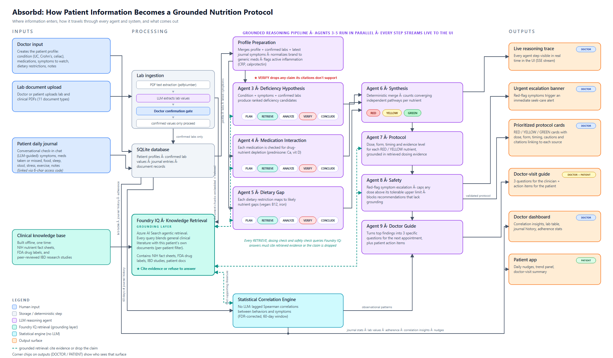

<div align="center">
  

  ### Clinically-grounded nutrition reasoning for inflammatory bowel disease

  *Actually absorb what you eat.*

  A multi-agent clinical reasoning system, grounded end to end in cited medical evidence

  [github.com/lkerleyaisolutions/absorbd](https://github.com/lkerleyaisolutions/absorbd)
</div>

---

## The problem

I built this for my brother, who has ulcerative colitis.

Managing nutrition with IBD is genuinely hard, and the difficulty is invisible. His
medications quietly deplete specific nutrients. His disease impairs absorption of the
nutrients that survive. His dietary restrictions remove whole categories of food. And
his gastroenterologist does not have 20 minutes per visit to reason through the
interaction of all three.

So the reasoning never happens, and patients are left guessing with a drawer full of
supplements.

**Absorbd does that reasoning.** It takes a patient's diagnosis, medications, disease
activity, dietary restrictions, lab values, and uploaded clinical documents, and
synthesizes them into a personalized nutrition protocol where **every single
recommendation carries a real clinical citation and an evidence level**. Then it hands
the patient three specific questions to bring to their next appointment.

It is not a chatbot that sounds confident. In a health context, the ability to **refuse
to answer when the evidence is not there** is the whole product.

Conditions covered: **Ulcerative Colitis · Crohn's Disease · Celiac Disease**

---

## How the reasoning works: 9 agents

A patient profile flows through nine specialized agents. Three of them run in true
parallel; the rest form a verification-and-synthesis chain.

| # | Agent | Role |
|---|-------|------|
| 1 | **Intake** | Conversational interview in plain language; resolves brand drug names to generics and walks a symptom checklist |
| 2 | **Profile** | Structures the conversation into a clean clinical profile |
| 3 | **Deficiency Hypothesis** *(parallel)* | Condition-based deficiency candidates |
| 4 | **Medication Interaction** *(parallel)* | Drug-nutrient depletions |
| 5 | **Dietary Gap** *(parallel)* | Nutrient gaps from dietary restrictions |
| 6 | **Synthesis & Prioritization** | Merges all findings, resolves conflicts, triages **RED / YELLOW / GREEN** |
| 7 | **Protocol** | Supplement form, dose, timing schedule, evidence level |
| 8 | **Safety** | Groundedness check, dose-ceiling enforcement, red-flag escalation |
| 9 | **Doctor Guide** | Three specific questions for the next appointment |

Each retrieval agent runs a visible multi-step loop
(**PLAN → RETRIEVE → ANALYZE → VERIFY → CONCLUDE**) and streams every step to the UI
over SSE, so the reasoning is watchable in real time rather than a black box.

The **VERIFY** step is adversarial: it re-reads the cited passage and **drops any
finding the source does not explicitly support**, attaching the exact supporting quote
to the ones that survive. When the knowledge base has no evidence for a drug, the agent
returns nothing rather than inventing a plausible answer.

### Hybrid by design, not pure-LLM

The steps that must never hallucinate are deterministic code, not model calls:

- **Synthesis** merges the three parallel agents with a unit-tested deterministic engine
  that *cannot* invent a nutrient. An LLM only handles the triage wording on top.
- **Safety** enforces upper limits and red-flag escalation in plain Python before any
  model is consulted.
- The **correlation engine** is pure statistics (lag-correlation over journal history):
  no LLM in the loop at all.

---

## The grounding layer: Foundry IQ

Absorbd uses **Foundry IQ** (Azure AI Search agentic retrieval) as the grounding layer
behind every agent query. This is not decorative. In a health context, the
anti-hallucination guarantee of grounded, cited retrieval **is** the core safety
feature. No clinical claim is asserted without a retrieved, cited source.

Two things make the integration go beyond a stock RAG bolt-on:

1. **Per-patient agentic retrieval.** A patient's uploaded labs and clinical documents
   are indexed with their `patient_id` and blended with the general clinical literature
   on *every* retrieval call. The same agent that cites NIH ODS for the general RDA also
   pulls *this patient's* ferritin value from *their* uploaded lab PDF. Retrieval is
   personalized per patient, not global.

2. **Citations are wired end to end.** Each agent returns the source URL and evidence
   level for every claim, and the UI renders them as clickable references on each
   protocol card.

**Knowledge base:** 699 grounded chunks: 13 NIH ODS nutrient fact sheets (health-
professional versions) and 15 FDA DailyMed labels for the major IBD medications,
embedded with `text-embedding-3-small` and retrieved via the
`knowledge_base_retrieve` MCP tool. Reasoning runs on `gpt-4.1-mini` at temperature 0.

The pipeline is **source-agnostic and designed to grow**: dropping in more clinical
evidence (ECCO 2025, ACG 2024, additional nutrients) directly sharpens every agent's
retrieval and citations. See [docs/SETUP.md](docs/SETUP.md#extending-the-knowledge-base)
for how to add a source.

---

## More than the reasoning core: a working clinical product

Absorbd is a two-sided application, not just a pipeline.

**Doctor side:** create an account, create patients with structured meds / symptoms /
dietary restrictions, upload lab PDFs (text extracted with `pdfplumber`, lab values
proposed by an LLM, then **confirmed by the doctor before anything is indexed**), review
journal history, and run the full 9-agent analysis.

**Patient side:** enter a 6-character access code, log a daily check-in through a
personalized symptom advisor, watch trends build over time, and generate a
patient-friendly visit summary.

**Correlation engine:** once a patient has journal history, a non-LLM statistical engine
surfaces observational patterns (e.g. a symptom that tracks a logged factor with a lag),
which feed the Doctor Guide as *observations to discuss*, never as causal claims.

---

## Architecture



Inputs and uploaded labs flow through the doctor-confirmation gate into SQLite and the
Foundry IQ index, then through profile preparation, the parallel reasoning trio, and the
synthesis → protocol → safety → doctor-guide chain. The Foundry IQ layer (dashed links)
grounds the trio, the protocol, the safety check, and the correlation engine.

---

## Try it yourself

A complete demo doctor and patient ship in the repo and load with **one offline
command**. You can explore most of the product with no cloud account at all.

**1. Backend** (Windows / PowerShell):

```powershell
git clone https://github.com/lkerleyaisolutions/absorbd.git
cd absorbd
python -m venv venv
.\venv\Scripts\Activate.ps1
pip install -r requirements.txt
Copy-Item .env.example .env        # empty values are fine just to boot and browse
python scripts\seed_demo.py        # core demo: Dr. Hartley + UC patient (62 days)
python scripts\seed_demo_extra.py  # 9 more patients across both doctors, all 3 conditions
uvicorn main:app --reload
```

On macOS / Linux: `source venv/bin/activate`, `cp .env.example .env`, then run both
`python scripts/seed_demo.py` and `python scripts/seed_demo_extra.py`.

**2. Frontend:**

```bash
cd absorb-iq-ui
npm install && npm run dev
```

Open **http://localhost:5173** (Vite proxies `/api` to the backend on port 8000).

**3. Log in with the seeded demo accounts.**

Two doctors, ten patients, spanning all three supported conditions. Start with patient
`DEMO01` (the primary demo: 62 days of history, 9 confirmed labs) or log in as a doctor
to see the full panel.

**Doctors:**

| Code | Doctor | Practice |
|------|--------|----------|
| `DOC-DEMO1` | Dr. Elena Hartley | GI Associates of Boston |
| `DOC-DEMO2` | Dr. Marcus Chen | Pacific Digestive Health |

**Patients:**

| Code | Name | Condition | Doctor |
|------|------|-----------|--------|
| `DEMO01` | (primary demo) | Ulcerative colitis | Hartley |
| `CROHN1` | Jordan Avery | Crohn's disease | Hartley |
| `CELIA1` | Sam Rivera | Celiac disease | Hartley |
| `REMIS1` | Taylor Brooks | Ulcerative colitis | Hartley |
| `FLARE1` | Morgan Lee | Crohn's disease | Hartley |
| `ENTYV1` | Casey Nguyen | Ulcerative colitis | Hartley |
| `FIST01` | Riley Patel | Crohn's disease | Chen |
| `NEWCE1` | Devin Carter | Celiac disease | Chen |
| `JAKUC1` | Quinn Foster | Ulcerative colitis | Chen |
| `MALNU1` | Avery Sullivan | Crohn's disease | Chen |

Both seed scripts write only to local SQLite and are safe to re-run. Each extra patient
has a distinct clinical story and a different planted behavioral correlation (food
triggers, missed-med lags, stress, sleep, exercise) that the correlation engine can
legitimately recover. The 22 sample clinical PDFs in `demo_docs/` can be uploaded through
the doctor view to exercise lab ingestion.

### What runs without Azure

The doctor dashboard, patient app, the 62-day journal and trend panels, daily check-ins,
lab-value tables, and the **statistical correlation engine** all run against local
SQLite. No Azure account needed.

### What needs Azure

The live **9-agent reasoning** ("Analyze"), LLM lab extraction, and the conversational
intake call **Foundry IQ + `gpt-4.1-mini`**. To run those, put real Azure values in
`.env` and build the knowledge base (below).

### Build the knowledge base (for full reasoning)

To run the live 9-agent reasoning, build the Foundry IQ knowledge base on your own
Azure. The full walkthrough (provisioning, env mapping, verification) is in
**[docs/SETUP.md](docs/SETUP.md)**. The short version, with real Azure values in `.env`:

```powershell
python scripts\create_index.py            # Azure AI Search index (vector + semantic)
python scripts\ingest_ods.py              # NIH ODS nutrient fact sheets
python scripts\ingest_dailymed.py         # FDA DailyMed IBD drug labels
python scripts\create_knowledge_base.py   # wire the knowledge source + knowledge base
```

This reproduces the 699-chunk knowledge base. `ingest_pmc.py` and `ingest_studies.py`
add optional extra sources.

---

## Tests

```powershell
pip install -r requirements-dev.txt
python -m pytest
```

**223 tests passing.** Coverage concentrates on the deterministic layers that must be
correct: medication normalization, symptom mapping, the synthesis merge engine, safety
red-flag and dose-ceiling logic, doctor-guide selection, and per-patient data isolation.

---

## Tech stack

- **Reasoning:** Azure AI Foundry (`azure-ai-projects`, Responses API), `gpt-4.1-mini`
- **Grounding:** Foundry IQ (Azure AI Search agentic retrieval), `text-embedding-3-small`
- **Backend:** FastAPI + Server-Sent Events for the live reasoning trace
- **Frontend:** React + Vite, three-phase UI (condition → chat intake → analysis)
- **Storage:** SQLite (doctors, patients, journal, documents, lab values)
- **Development:** built solo, using Claude Code as the agentic coding environment

---

## License

**Proprietary, all rights reserved.** © 2026 Logan Kerley. The source is published for
viewing as a portfolio piece. It may not be used, reproduced, modified, distributed, or
sold without prior written permission. See [LICENSE](LICENSE) for the full terms (the
bundled NIH ODS and FDA DailyMed documents remain U.S. public domain).

---

## Disclaimer

Absorbd is an educational tool, not a medical device. It does not diagnose, treat, or
replace a physician. Every output is framed as information to discuss with a
gastroenterologist, and the system is built to stay silent rather than guess when the
evidence is not there.
